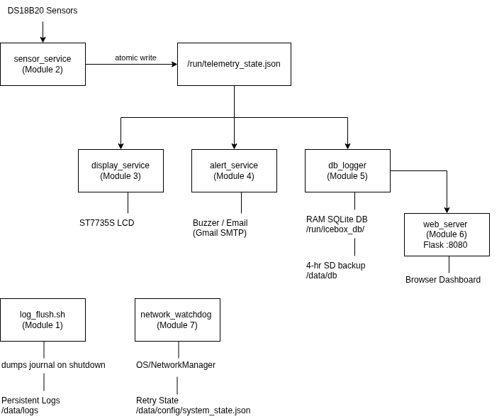

# IceboxHero — Raspberry Pi Zero Freezer Monitor

<p align="center"></p>

A self-contained, fault-tolerant freezer temperature monitoring system built on a Raspberry Pi Zero 2 W. All acquisition, storage, alerting, web hosting, and watchdog functions run locally. No cloud backend is required for core operation. Designed for unattended, always-on operation with aggressive SD card wear minimization and hardware-enforced auto-recovery.

---

## Features

- Continuous DS18B20 temperature monitoring via 1-Wire bus
- Per-sensor configurable temperature thresholds — each freezer has its own warning and critical levels
- Configurable alert holdoff — WARNING and CRITICAL require sustained readings before alerting, preventing door-open spikes from triggering false alarms
- Local ST7735S LCD display with per-sensor color-coded status and 1 Hz critical flashing
- Boot splash screen suppresses false alerts during startup
- Piezo buzzer alarm with hardware silence button
- Email alerts (Gmail/SMTP) with in-memory retry queue — survives network outages
- External uptime monitoring via [healthchecks.io](https://healthchecks.io) dead-man's snitch
- SQLite database lives in RAM; backs up to SD card every 4 hours — final backup triggered on clean shutdown
- Read-only root filesystem — SD card protected against power-loss corruption
- Hardware watchdog forces a reboot if the sensor service hangs
- Network watchdog detects wifi stack failures — restarts NetworkManager, then reboots (up to 3 times) before falling back to NM-only retries; state persisted in `/data/config/system_state.json`
- Flask web dashboard with 24-hour temperature graph and one-click log download, served entirely from local storage
- All behavior tunable via `config.ini` — no code changes required

---

## Hardware Requirements

| Component | Details |
|---|---|
| Compute | Raspberry Pi Zero 2 W |
| Sensors | DS18B20 digital temperature sensors, 1-Wire bus (GPIO4), 4.7 kΩ pull-up resistor |
| Display | ST7735S 1.8" SPI LCD |
| Buzzer | Active HIGH piezo buzzer (GPIO17) |
| Silence Button | Momentary push button, active LOW (GPIO27) |

### Default GPIO Pinout

| Signal | GPIO | Physical Pin |
|---|---|---|
| 1-Wire Data | GPIO4 | Pin 7 |
| Buzzer | GPIO17 | Pin 11 |
| Silence Button | GPIO27 | Pin 13 |
| LCD DC | GPIO24 | Pin 18 |
| LCD RST | GPIO25 | Pin 22 |
| SPI MOSI (LCD SDA) | GPIO10 | Pin 19 |
| SPI CLK (LCD SCL) | GPIO11 | Pin 23 |
| SPI CE0 (LCD CS) | GPIO8 | Pin 24 |

> **Note on display labels:** Chinese ST7735 modules label SPI MOSI as `SDA` and SPI CLK as `SCL`. This is a mislabeling — it is SPI, not I2C. Wire SDA→GPIO10 and SCL→GPIO11. Wire the `BLK` (backlight) pin directly to 3.3V for always-on operation, or leave it disconnected if the module has an internal pull-up.

All pins are configurable in `config.ini`.

## 3D Printed Enclosure

To keep this repository lightweight, the physical housing files are hosted externally. The custom enclosure is designed to mount the Raspberry Pi Zero 2 W, the ST7735S display, the buzzer, and the silence button.

* [**Download the IceboxHero Enclosure on Printables**](https://www.printables.com/model/1690434-iceboxhero-enclosure-raspberry-pi-zero-2-w-freezer)

The Printables page includes both the ready-to-slice `.stl` file and the parametric OpenSCAD (`.scad`) source file, allowing you to adjust the housing dimensions to fit your specific display module or hardware variations.

---

## System Architecture

Eight modules make up the full system. Module 0 (`config_helper.py`) is a shared library imported by all services — it is not a running process. Module 1 covers the OS layer: systemd units, tmpfiles.d, watchdog config, and the data mount. Modules 2–7 are independent long-running services that communicate exclusively through shared files on the RAM disk (`/run`). No service calls another directly — a crash in any single service does not affect the others. systemd restarts each service independently.

<p align="center"></p>

> Modules 0 and 1 are cross-cutting infrastructure — `config_helper.py` is imported by every service; the systemd units and watchdog underpin all seven. They are intentionally omitted from the data-flow diagram above. For full design notes see [`docs/ARCHITECTURE.md`](docs/ARCHITECTURE.md).

### Module Summary

| Module | File(s) | Role |
|---|---|---|
| 0 — Configuration | `config_helper.py`, `config.ini` | Shared config parser, sensor config, and JSON utility |
| 1 — OS & Services | `systemd/*.service`, `watchdog.conf`, `log_flush.sh` | Filesystem layout, watchdog, systemd units, shutdown log flush |
| 2 — Sensor Acquisition | `sensor_service.py` | DS18B20 1-Wire reads; atomic IPC file writer |
| 3 — Display | `display_service.py` | ST7735S LCD driver; per-sensor color-coded status |
| 4 — Alerts & Email | `alert_service.py` | Buzzer control, GPIO silence button, SMTP retry queue |
| 5 — Database Logger | `db_logger.py` | RAM SQLite DB; 4-hour SD backup; automatic pruning |
| 6 — Web Server | `web_server.py`, `templates/index.html` | Flask REST API; 24-hour graph dashboard |
| 7 — Network Watchdog | `network_watchdog.sh`, `system_state.json` | Network stack monitor; handles wifi auto-recovery, NM restarts, and hardware reboots |

---

## Filesystem Design

Three storage areas with distinct access patterns:

| Path | Type | Purpose |
|---|---|---|
| `/opt/iceboxhero/` | Read-Only (overlay) | All Python source code and templates |
| `/run/` | RAM (tmpfs) | IPC state file; live SQLite database |
| `/data/` | Read-Write (ext4) | SD backup of SQLite; config |

**SD card writes under normal operation:**
- One full database backup every 4 hours (configurable)
- Zero writes from the OS root partition

The live database resides entirely in RAM (`/run/icebox_db/freezer_monitor.db`). On each boot it is restored from the last SD card backup. On a sudden power loss, up to 4 hours of temperature history may be lost — this is intentional. The SD card's longevity is the design priority.

---

## Operational Behavior

### Temperature State Machine

Each sensor is evaluated independently against its own configured thresholds. The display shows each sensor in its own state color simultaneously.

| State | Condition | LCD | Buzzer | Email |
|---|---|---|---|---|
| Normal | Below warning threshold | White on Black | Off | — |
| Warning | ≥ warning threshold for `alert_holdoff_minutes` | Black on Yellow | Off | Yes (60-min cooldown) |
| Critical | ≥ critical threshold for `alert_holdoff_minutes` | Flashing White/Red @ 1 Hz | On | Yes (60-min cooldown) |
| Missing Sensor | 3 consecutive None reads | `--.-F`, flashing red | On | Yes |
| Stale Data | IPC file > 10 min old | `STALE DATA`, flashing | On | Yes |

Default thresholds (configurable per sensor in `config.ini`): warning = 10°F, critical = 15°F, holdoff = 5 minutes.

> **Note:** The hardware watchdog reboots the Pi after 180 seconds of stale IPC data — well before the 10-minute STALE DATA display threshold is reached. The STALE DATA state is a second line of defence for the unlikely scenario where the watchdog daemon itself fails.

### Email Alerts

Emails arrive with one of two subject prefixes to support inbox filtering:

- **`[ALERT]`** — Requires immediate attention. Covers: CRITICAL, WARNING, FAILURE, SYSTEM_ERROR.
- **`[STATUS]`** — Informational only. Covers: SYSTEM_BOOT, CHECKIN.

**Recommended Gmail filter:** Subject contains `[STATUS] IceboxHero` → Skip Inbox, Mark as read, Apply label.

The email thread runs independently of the buzzer. If the network is down at alert time, the email is queued in memory and retried every 5 minutes until it succeeds. A periodic checkin email (default: every 30 days) confirms the system is alive during long uptimes with no reboots. The timer is in-memory — a reboot resets it, which is fine since SYSTEM_BOOT fires on every boot anyway.

### Silence Button

Pressing the button silences the buzzer for 1 hour. The alarm condition continues to be tracked in software. If the temperature remains critical after 1 hour, the buzzer reactivates automatically.

### Hardware Watchdog

The Linux hardware watchdog monitors `/run/iceboxhero/telemetry_state.json` for changes. If `sensor_service.py` fails to update the file for 180 consecutive seconds, the watchdog forces a full hardware reboot. systemd restarts all services automatically on reboot. The 180-second window accommodates the 60-second polling interval plus sensor conversion time and scheduler jitter.

### External Health Monitoring (healthchecks.io)

Two independent UUIDs provide visibility into different failure modes:

- **System-alive ping** — Fired after every successful database write (every 5 min). Grace: 15 min. Detects Pi death, power loss, or DB loop crash.
- **Email-alive ping** — Fired on boot and on each periodic checkin. Grace: 35 days. Detects Gmail credential expiration or SMTP configuration issues. No persistent state file required.

Both URLs are optional. Leave them as the placeholder value in `config.ini` to disable.

---

## Installation

### Step 1 — Prevent Auto-Expand and Create the /data Partition (one-time, manual)

This is the only step that cannot be automated. `fdisk` is destructive and must be run deliberately.

#### 1a. Disable Auto-Expand Before First Boot

By default, Raspberry Pi OS expands the root partition (`p2`) to fill the entire SD card on first boot. You must prevent this **before the Pi boots for the first time** to leave unallocated space for the `/data` partition (`p3`).

1. Flash Raspberry Pi OS Lite (32-bit recommended) to your SD card using [Raspberry Pi Imager](https://www.raspberrypi.com/software/).
2. Remove and re-insert the SD card into your PC. The `bootfs` FAT32 volume will mount automatically.
3. Open `cmdline.txt` in a text editor.
4. Find and **delete** this exact string (leave everything else on the line intact):
   ```
   init=/usr/lib/raspi-config/init_resize.sh
   ```
5. Save the file, eject the SD card, and insert it into the Pi. Boot normally.

> If you skip this step and the root partition has already been expanded to fill the card, you will need to shrink `p2` with a partition tool before you can create `p3`. It is much easier to do this before first boot.

#### 1b. Create the /data Partition

Once booted and logged in, you will have unallocated space after `p2`. Use `fdisk` to create `p3`:

```bash
sudo fdisk /dev/mmcblk0
```

At the `fdisk` prompt:
```
Command: n          # new partition
Type:    p          # primary
Number:  3          # partition 3
First:   (press Enter — accept default)
Last:    (press Enter — use remaining space)
Command: w          # write and exit
```

Then format and mount:

```bash
sudo mkfs.ext4 /dev/mmcblk0p3
sudo mkdir -p /data/config /data/db /data/logs
sudo mount /dev/mmcblk0p3 /data
sudo chown -R pi:pi /data
```

> Do **not** add `/data` to `/etc/fstab`. `setup.sh` installs a systemd `data.mount` unit that handles mounting correctly and bypasses the overlay filesystem.

### Step 2 — Clone and Run Setup

```bash
git clone https://github.com/crakerjac/IceboxHero.git /data/IceboxHero
cd /data/IceboxHero
sudo ./setup.sh
```

`setup.sh` handles everything automatically:
- Configures hardware overlays (watchdog, SPI, 1-Wire) in `/boot/firmware/config.txt`
- Installs system packages and Python dependencies
- Deploys source code to `/opt/iceboxhero/`
- Installs and enables all systemd services
- Configures the hardware watchdog
- Disables cloud-init (not needed on a local Pi deployment)

### Step 3 — Configure

```bash
sudo nano /data/config/config.ini
```

**Required:** Set your sensor ROM IDs, Gmail address, and Gmail App Password.

The new per-sensor config format — one `[sensor N]` section per physical sensor:

```ini
[sensor 1]
id = 28-00000071c774
name = Big Freezer
warning = 10.0
critical = 15.0

[sensor 2]
id = 28-0000007005ed
name = Small Freezer
warning = 5.0
critical = 10.0
```

Find your sensor ROM IDs after reboot:
```bash
ls /sys/bus/w1/devices/28-*/
```

**Optional:** Configure healthchecks.io UUIDs in `[network]` for external monitoring. Leave as placeholders to disable.

### Step 4 — Reboot and Start

```bash
sudo reboot
# After reboot:
sudo /opt/iceboxhero/start_services.sh
```

`start_services.sh` confirms sensors are detected and config is valid before starting anything.

### Step 5 — Enable Read-Only Overlay (Production)

Once everything is working correctly:

```bash
sudo raspi-config
# Performance Options → Overlay File System → Enable
```

**Do this last.** Once enabled, any changes to the root filesystem require temporarily disabling the overlay. All permanent config lives on `/data/` which is always read-write.

---

## Sensor Configuration

Each sensor gets its own `[sensor N]` section in `config.ini`. Thresholds are per-sensor — different freezers can have different warning and critical levels:

```ini
[sensor 1]
id = 28-xxxxxxxxxxxx           # ROM ID from /sys/bus/w1/devices/
name = Big Freezer             # Display name — shown on LCD and web dashboard
warning = 10.0                 # °F — yellow on display, email alert
critical = 15.0                # °F — flashing red, buzzer, email alert
alert_holdoff_minutes = 5      # Minutes of sustained threshold crossing before alerting
```

If `warning`, `critical`, or `alert_holdoff_minutes` are omitted, the global defaults from `[sampling]` and `[alerts]` are used as fallback.

---

## Starting and Stopping Services

```bash
sudo /opt/iceboxhero/stop_services.sh     # watchdog first, then all services
sudo /opt/iceboxhero/start_services.sh    # all services, then watchdog last
```

`start_services.sh` includes two preflight checks before starting anything:

- Confirms at least one DS18B20 sensor is visible on the 1-Wire bus at `/sys/bus/w1/devices/28-*`
- Confirms `config.ini` no longer contains the placeholder sensor ROM IDs

### Working Without Sensors Connected (Setup and Maintenance Mode)

Any time you need to work on the system without sensors physically connected — editing config, redeploying code, running `uninstall.sh` — stop services first:

```bash
sudo /opt/iceboxhero/stop_services.sh
# do your work
sudo /opt/iceboxhero/start_services.sh    # when sensors are reconnected and ready
```

### Testing the Setup Script

To re-run `setup.sh` from a clean state without reimaging the SD card:

```bash
sudo /opt/iceboxhero/stop_services.sh
sudo ./uninstall.sh
sudo ./setup.sh
```

---

## Testing Without Hardware

`mock_sensors.py` replaces `sensor_service.py` for testing before physical sensors arrive. It reads sensor names and thresholds from `config.ini` and writes the same IPC file format all downstream services consume — they can't tell the difference.

### Setup

Stop `icebox-sensor.service` first to avoid race conditions with the IPC file, then run the mock directly:

```bash
sudo systemctl stop icebox-sensor.service

# From the repo directory:
python3 mock_sensors.py --mode sine

# Or if already deployed by setup.sh:
python3 /opt/iceboxhero/mock_sensors.py --mode sine
```

By default the mock uses `poll_interval` from `config.ini` (60 seconds). Use `--interval` to override this for faster testing:

```bash
# Update every second — good for watching ramp and state transitions in real time
python3 mock_sensors.py --mode ramp --interval 1

# Match actual sensor polling without waiting a full minute per step
python3 mock_sensors.py --mode sine --interval 5
```

### Modes

| Mode | What it does |
|---|---|
| `sine` (default) | Slow sine wave drifting from normal through warning and critical |
| `normal` | Steady 8°F below warning threshold |
| `warning` | Steady 1°F above warning threshold |
| `critical` | Steady 2°F above critical threshold — triggers buzzer and email after 2 reads |
| `missing` | First sensor returns `None` — triggers FAILURE alert after 3 consecutive reads |
| `ramp` | Ramps up 1°F per poll cycle, wraps at critical+5 — good for watching state transitions |

### What You Can Test

- **Display** — per-sensor colors, 1 Hz flash at CRITICAL, font sizing, STALE DATA overlay
- **Alerts** — buzzer fires at correct threshold, silence button mutes it, re-arms after 1 hour
- **Email** — CRITICAL and WARNING emails arrive, cooldown prevents flooding, SYSTEM_BOOT on start
- **Web dashboard** — current readings update every 30s, 24-hour graph populates over time
- **Database** — RAM DB writes every 5 minutes, 4-hour SD backup fires, web history graph works
- **Watchdog** — stays quiet while IPC updates; kill the mock script and verify reboot after 180s

Stop the mock with `Ctrl+C`. The IPC file is left in place so downstream services don't immediately go stale — they will naturally time out after `stale_timeout` seconds (default: 600).

---

## Display Identification

Chinese ST7735 modules often ship with no documentation. `display_test.py` cycles through known configurations and pushes test patterns so you can visually confirm which variant you have. On success it writes the working parameters directly to `config.ini`.

> **Wiring note:** The `SDA` and `SCL` labels on these modules are SPI, not I2C. Wire `SDA → GPIO10` (MOSI) and `SCL → GPIO11` (CLK). Wire `BLK` directly to 3.3V for always-on backlight, or leave disconnected if the module has an internal pull-up. Wire `RST → GPIO25`.

```bash
# List all candidates without touching hardware
python3 display_test.py --list

# Run the interactive identification tool
python3 display_test.py
```

The tool tests solid red, green, and blue fills (BGR vs RGB swap is immediately obvious), then color bars with a resolution label. Enter `a` at the menu to test all candidates in order, or enter a number to jump to a specific one. When you confirm a match the display params are written to `config.ini` and picked up by `display_service.py` on next start.

If nothing matches, check:
- **Blank screen** — VDD (3.3V), GND, and SPI wiring
- **Backlight only** — display init failing silently, try a different candidate
- **Colors shifted** — try BGR=True vs BGR=False variants
- **Image cropped or offset** — try x_offset/y_offset variants

---

## Diagnostics

```bash
# Live log stream from any service
journalctl -u icebox-sensor.service -f
journalctl -u icebox-alert.service -b     # current boot only
journalctl -u icebox-db.service -n 50     # last 50 lines

# Check current sensor readings
cat /run/iceboxhero/telemetry_state.json

# Check saved boot logs (last 3 boots)
ls /data/logs/icebox_boot_*.log

# Check persistent system state (network watchdog counters)
cat /data/config/system_state.json

# Or download all logs from the web dashboard:
# http://iceboxhero.local:8080  →  Download Logs button

# Check RAM disk usage
df -h /run

# Check all service status at a glance
systemctl status 'icebox-*'
```

---

## Repository Structure

```
IceboxHero/
├── README.md
├── LICENSE
├── .gitignore
├── setup.sh                     # Automated setup script — run after Step 1
├── uninstall.sh                 # Reverses setup.sh — for testing and reinstallation
├── start_services.sh            # Starts all services and the watchdog
├── stop_services.sh             # Stops watchdog first, then all services
├── update.sh                    # Updates deployed code with minimal downtime
├── config.ini.template          # Configuration template — copy to /data/config/config.ini
├── config_helper.py             # Shared config parser, sensor config  (Module 0)
├── sensor_service.py            # DS18B20 acquisition service          (Module 2)
├── display_service.py           # ST7735S LCD display service          (Module 3)
├── alert_service.py             # Buzzer, button, email alerts         (Module 4)
├── db_logger.py                 # RAM SQLite DB + SD backup            (Module 5)
├── web_server.py                # Flask API and dashboard              (Module 6)
├── mock_sensors.py              # Dev tool — simulates sensors without hardware
├── display_test.py              # Dev tool — identifies display variant, writes config
├── templates/
│   └── index.html               # Web dashboard UI
├── static/
│   ├── favicon.png              # Browser tab icon
│   ├── color_logo.png           # Project logo
│   └── splash.jpg               # Boot splash screen
├── docs/
│   ├── architecture-overview.png  # Data flow diagram — displayed in README
│   ├── architecture-full.png      # Full module diagram — displayed in ARCHITECTURE.md
│   └── ARCHITECTURE.md            # Full design notes, runtime paths, watchdog detail
├── network_watchdog.sh          # Network stack watchdog — 3+3 retry logic, system_state.json
├── log_flush.sh                 # Dumps journal to /data/logs on clean shutdown/reboot
└── systemd/
    ├── icebox-sensor.service
    ├── icebox-display.service
    ├── icebox-alert.service
    ├── icebox-db.service
    ├── icebox-web.service
    ├── icebox-watchdog.service
    ├── icebox-netwatchdog.service
    ├── icebox-netwatchdog.timer
    └── icebox-logflush.service
```

---

## Future Enhancements

- **Trend & predictive analysis** (`trend_service.py`) — Use the historical SQLite database to model temperature trends per sensor. Alert when a freezer temperature is rising toward a threshold rather than only after it has been crossed. Recommended approach: collect at least 30 days of baseline data first, then model rate-of-change per sensor. Per-sensor thresholds are already implemented which reduces urgency — a rising trend alert would complement them rather than replace them.

- **Derived state in IPC payload** — Both `alert_service` and `display_service` independently track `critical_read_counts` and `first_real_read` by reading the same IPC file. Since they poll at different intervals (1s vs 500ms), their counts can briefly diverge — the display may show CRITICAL one poll before the buzzer fires, or vice versa. The cleanest fix is to have `sensor_service` write derived state (consecutive critical counts per sensor) directly into the IPC payload. Consumers would then react to state they read rather than state they infer, and display and alert would always be in sync. This would be a meaningful refactor of `sensor_service` and all consumers.

---

## License

GNU General Public License v3.0
