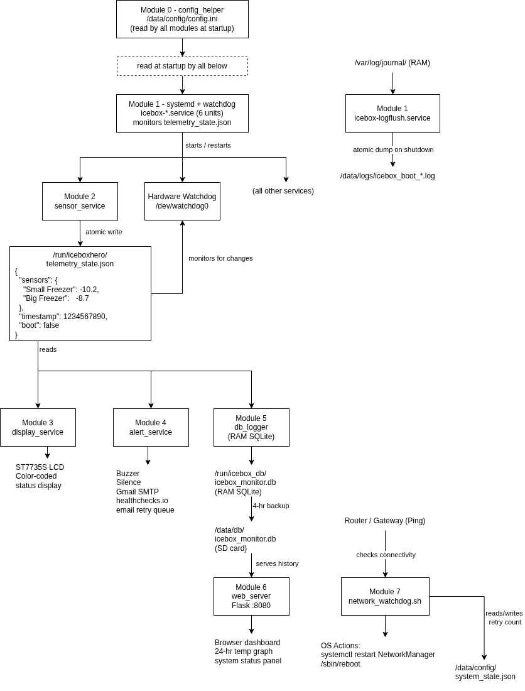

# IceboxHero — System Architecture

This document describes the software architecture of IceboxHero in detail.
The simplified data-flow diagram in the README is `docs/architecture-overview.png`.

---

## Full Module Diagram

<p align="center"></p>

---

## Design Principles

### No direct module-to-module calls
All inter-module communication goes through `/run/iceboxhero/telemetry_state.json`.
No module imports or calls another. A crash in any single module leaves all others
running normally. systemd restarts the crashed module independently.

### RAM-first storage
The live SQLite database lives entirely in `/run/icebox_db/` (tmpfs). SD card writes
are limited to one backup every 4 hours. The root filesystem runs read-only under
raspi-config's overlay filesystem. This eliminates SD card corruption from power loss
and extends card lifespan to the practical maximum.

### Hardware watchdog as last resort
`/usr/sbin/watchdog` monitors `telemetry_state.json` for changes. If `sensor_service`
fails to update the file for 180 consecutive seconds, the watchdog writes to
`/dev/watchdog0` which triggers a full hardware reboot — independent of the OS,
systemd, or any Python process. The 180s window = 60s poll interval + conversion
time + scheduler jitter + 2x safety margin.

### Per-sensor thresholds
Each sensor has independently configurable warning and critical thresholds in
`config.ini`. The display renders each sensor's half of the screen in its own
state color. The buzzer fires if any sensor is in a critical or failure state.

### Fault isolation
```
sensor_service crash  → display shows STALE DATA, alert emails, watchdog reboots
display_service crash → temperatures still logged, alerts still fire, web still works
alert_service crash   → temperatures still logged, display still updates
db_logger crash       → display and alerts still work, history lost until restart
web_server crash      → all monitoring continues, dashboard temporarily unavailable
```

### Config error handling
If `config.ini` fails to load at startup, `alert_service` sounds the buzzer on a
hardcoded GPIO17 fallback and loops forever (keeping the service "running" so systemd
does not restart-loop). `display_service` pushes a red CONFIG ERROR screen. The
healthchecks.io heartbeat stops, triggering a dead-man email after its grace period.

---

## Runtime Paths

| Path | Type | Purpose |
|---|---|---|
| `/run/iceboxhero/telemetry_state.json` | tmpfs | IPC state file — pre-created by tmpfiles.d at boot |
| `/run/iceboxhero/telemetry_state.tmp` | tmpfs | Atomic write temp (sensor_service only) |
| `/run/iceboxhero/db_corrupted.flag` | tmpfs | DB corruption signal to alert_service |
| `/run/icebox_db/freezer_monitor.db` | tmpfs | Live SQLite database |
| `/data/config/config.ini` | ext4 | Working config (never committed to git) |
| `/data/db/freezer_monitor.db` | ext4 | 4-hour SD card backup of SQLite |
| `/data/db/last_backup` | ext4 | Timestamp of last successful SD backup |
| `/opt/iceboxhero/` | read-only overlay | Deployed Python source code |
| `/opt/iceboxhero/config.ini.template` | read-only overlay | Default values for config_helper fallback |
| `/etc/tmpfiles.d/iceboxhero.conf` | root | Creates runtime dirs + IPC file at boot |
| `/etc/watchdog.conf` | root | Watchdog config (change=180, pidfile) |
| `/etc/default/watchdog` | root | run_watchdog=1 (required for daemon start) |
| `/etc/systemd/system.conf.d/` | root | Disables systemd RuntimeWatchdog |

---

## Watchdog Architecture

```
Boot
 │
 ▼
tmpfiles.d creates /run/iceboxhero/telemetry_state.json
 │                 {"sensors":{},"timestamp":0,"boot":true}
 ▼
systemd starts icebox-sensor.service
 │
 ▼
sensor_service begins writing real data every 60s
 │
 ▼
start_services.sh (or boot) starts icebox-watchdog.service
 │
 ▼
/usr/sbin/watchdog -F
 │  reads /etc/watchdog.conf
 │  opens /dev/watchdog0
 │  monitors telemetry_state.json for changes
 │  pets /dev/watchdog0 every ~10s while file is changing
 │
 └─► if file unchanged for 180s → stops petting → hardware reboot
```

The watchdog daemon is NOT systemd's built-in RuntimeWatchdog — that is explicitly
disabled via `/etc/systemd/system.conf.d/disable-runtime-watchdog.conf` so systemd
does not claim `/dev/watchdog0` before our daemon can open it.

If the watchdog fires and the system enters a reboot loop, the healthchecks.io
system-alive ping will stop firing. After the configured grace period (default: 15 min),
healthchecks.io sends an alert email independent of the Pi's ability to send email.

---

## Sensor Configuration

Sensors are configured in `config.ini` using numbered `[sensor N]` sections:

```ini
[sensor 1]
id = 28-00000071c774    # DS18B20 ROM ID
name = Big Freezer      # Display name
warning = 10.0          # °F warning threshold
critical = 15.0         # °F critical threshold

[sensor 2]
id = 28-0000007005ed
name = Small Freezer
warning = 5.0
critical = 10.0
```

`config_helper.get_sensor_configs()` parses all `[sensor N]` sections and returns
a list of dicts with id, name, warning, and critical keys. Missing warning/critical
values fall back to the global defaults in `[sampling]`.

---

## Boot Sequence

```
Power on
 │
 ▼
tmpfiles.d — creates /run/iceboxhero/ and /run/icebox_db/ with correct ownership
 │           pre-populates telemetry_state.json with boot state
 ▼
systemd starts all icebox-*.service units (except watchdog)
 │
 ├─► sensor_service  — reads DS18B20 sensors, writes IPC file every 60s
 ├─► display_service — shows splash screen, waits for first real sensor read
 ├─► alert_service   — waits for NTP, sends SYSTEM_BOOT email, then monitors
 ├─► db_logger       — restores DB from SD backup, waits for NTP, logs telemetry
 └─► web_server      — serves Flask dashboard on port 8080
 │
 ▼
icebox-watchdog.service starts (After=icebox-sensor.service)
 │
 └─► /usr/sbin/watchdog -F begins monitoring IPC file
```
